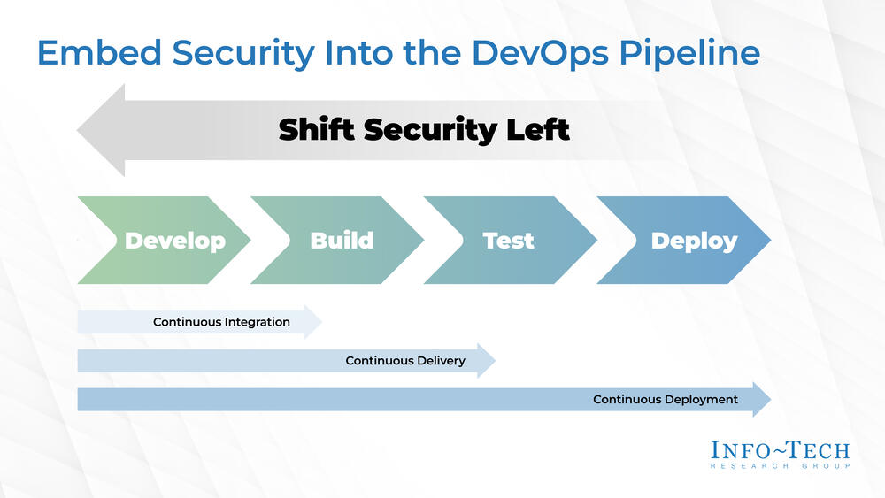

# 💻 Intégrer la sécurité au cœur du DevOps  
## Introduction à la DevSecOps

**Objectif :** Comprendre, intégrer et échanger autour de la pratique DevSecOps.

---

# I. Introduction

---

## 🌍 Contexte et constats

- La sécurité souvent traitée **trop tard** dans le cycle de développement  
- Multiplication des vulnérabilités et incidents  
- DevOps a accéléré les déploiements, mais… la sécurité doit suivre !

---

## ❓ Problématique

> Comment faire de la sécurité un **réflexe dès la conception** sans ralentir les équipes ?

---

## 📋 Objectifs de la conférence

- Comprendre la **philosophie DevSecOps**  
- Identifier les **bonnes pratiques**  
- Découvrir des **outils concrets**  
- Favoriser le **retour d’expérience et le dialogue**

---

# II. Découvrir les fondamentaux de la DevSecOps  

---

## 🧬 Origines de la DevSecOps

- DevOps : collaboration entre **développement** et **opérations**  
- DevSecOps : inclusion du **facteur sécurité** dans cette démarche  
- Objectif : **“Security as Code”** – la sécurité automatisée, continue et intégrée

---

## ⚙️ Les 3 piliers de la DevSecOps

1. **Culture** – Collaboration et responsabilité partagée  
2. **Automatisation** – Intégrer la sécurité dans la CI/CD  
3. **Surveillance continue** – Feedback et amélioration constante

---

## ✅ Les bénéfices

- Réduction des vulnérabilités  
- Meilleure conformité et auditabilité  
- Détection précoce = réduction des coûts  
- Confiance accrue entre équipes

---

## 📚 Exemples concrets
👉 Jusqu’à 70 % de vulnérabilités critiques évitées avant la mise en ligne (source : rapports Snyk, GitLab 2024).
👉 Un acteur bancaire européen a remplacé l'étape de validation manuelle par des tests OWASP ZAP automatisés dans Jenkins ; les délais de validation sécurité sont passés de 3 jours à moins d’une heure.

---

# III. Intégrer la sécurité dès la conception 

---

## ⏪ Le principe du "Shift Left Security"

- Détecter les failles **avant** la mise en production  
- Responsabiliser les développeurs sur les risques  
- Intégrer la sécurité **dans les phases de design et de test**

---

<!--
_footer: Source : https://www.infotech.com/research/ss/embed-security-into-the-devops-pipeline
-->

---

## 🧠 Bonnes pratiques de conception sécurisée

- **Threat Modeling** (modélisation des menaces)  
- **Revue de code** et **tests automatisés**  
- **Principe du moindre privilège**  
- Gestion des **secrets**, **dépendances** et **mises à jour**

---

## 🛠️ Outils clés DevSecOps

- **SAST** – Static Application Security Testing  
- **DAST** – Dynamic Application Security Testing  
- **Dependency Checking** – Vulnérabilités open source / supply chain  
- **IaC Scanning** – sécurité des infrastructures as code

---

# IV. Les outils en pratique 

---

## 🧩 SAST – Static Application Security Testing

### 🔍 Principe  
Analyse le **code source** sans exécution pour détecter des failles comme injection SQL, buffer overflow, mots de passe codés en dur.

### 🛠️ SonarQube, Semgrep, GitLab SAST

### 💡 Exemple concret
- Une API Python est analysée à chaque *commit* avec **GitLab SAST**.  
- Le scanner détecte un mot de passe codé en dur.  
- L’équipe reçoit une alerte et déplace le secret dans un gestionnaire sécurisé.  
✅ **Résultat :** vulnérabilité éliminée avant déploiement.

---

## 🌐 DAST – Dynamic Application Security Testing

### 🔍 Principe  
Teste une **application en exécution**, comme le ferait un attaquant : injection, XSS, mauvaise configuration.

### 🛠️ OWASP ZAP, Burp Suite

### 💡 Exemple  
- Une app web est déployée sur un environnement de test.  
- **OWASP ZAP** exécute un scan automatisé via la CI/CD.  
- Une faille **XSS** est détectée sur un formulaire.  
✅ **Résultat :** correction avant mise en production.

---

## 🧱 Sécurité des dépendances

### 🔍 Principe  
Analyse les **bibliothèques tierces** pour identifier des versions vulnérables (CVE).

### 🛠️ OWASP Dependency-Check, Snyk, Dependabot, Trivy

### 💡 Exemple  
- **Dependabot** scanne les dépendances npm d’un projet React.  
- Il détecte une faille dans `lodash`.  
- Une **Pull Request automatique** propose la mise à jour.  
✅ **Résultat :** sécurité renforcée sans effort manuel.

---

## ☁️ IaC Scanning – Infrastructure as Code

### 🔍 Principe  
Analyse les fichiers **Terraform, CloudFormation, Ansible** pour éviter les erreurs de configuration.

### 🛠️ Checkov, tfsec, Terrascan, Trivy

### 💡 Exemple  
- Checkov détecte un bucket **S3 public**.
- L’alerte **bloque** le déploiement.
✅ **Résultat** : fuite de données évitée avant la création de l’infrastructure.

---

## 🧭 Synthèse : quand et pourquoi utiliser ces outils ?

| Type |	Objectif |Outil |	Exemple	 |Phase |
|---|---|---|---|---|
|SAST  |	Analyser le code source |	SonarQube	 |Mot de passe codé en dur |	Avant build |
|DAST	|Tester l’app en exécution	|OWASP ZAP|	Détection d’un XSS|	En test|
Dependency Checking	|Vérifier les librairies tierces	|Snyk / Dependabot|	MAJ auto d’une dépendance	|À chaque commit
IaC Scanning	|Sécuriser l’infrastructure as code	|Checkov / tfsec	|S3 public détecté|	Avant déploiement

---

## 🔄 Message clé

> Chaque étape du cycle DevOps peut intégrer un contrôle de sécurité.
Ensemble, ces outils font de la DevSecOps une pratique continue, automatisée et collaborative.

---

## 🙌 Merci pour votre attention

💬 Discutons des outils que vous utilisez ou souhaiteriez mettre en place !

📧 [mathieulaude@gmail.com](mailto:mathieulaude@gmail.com)
🔗 [https://www.linkedin.com/in/mathieulaude/](https://www.linkedin.com/in/mathieulaude/)
