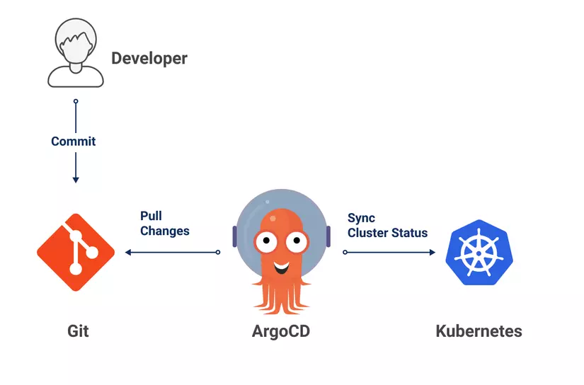
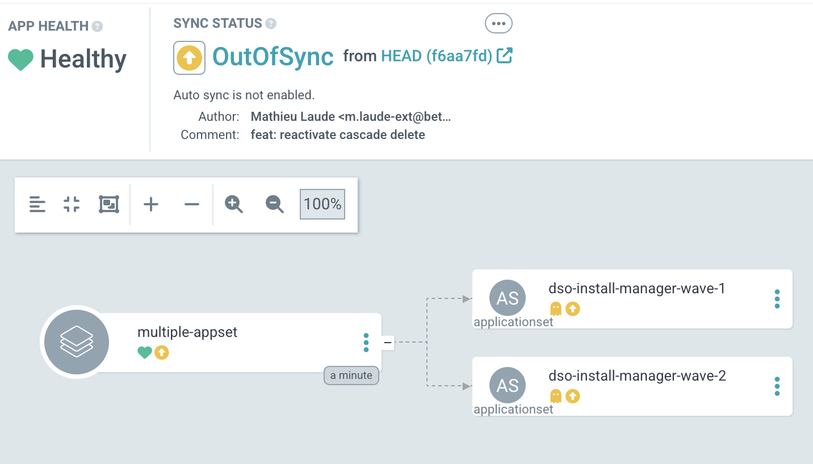
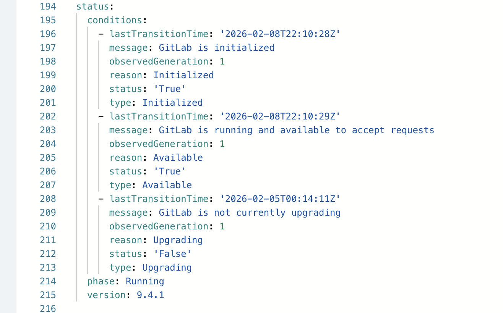

# Au-delà du cœur vert 💚 
## Optimiser vos déploiements Argo CD  


France Devops - Mardi 3 mars - 12h

---

## 👋 Qui suis-je ?

- Consultant et formateur indépendant
- Senior Developer / Platform Engineer
- Passionné par le GitOps, Kubernetes et l’observabilité
- Curieux et fan de l'amélioration continue


### ➡️ [linkedin.com/in/mathieulaude](https://www.linkedin.com/in/mathieulaude/)

---

## 🧭 Agenda

1. Comment Argo CD évalue la santé
3. Limites des Health Checks par défaut
4. Les Custom Health Checks
5. Cas d’usage concrets
7. Bonnes pratiques
8. Conclusion

---


## 🚀 Préambule - Argo CD

### Qu’est-ce que c’est ?
Moteur de déploiement continu **GitOps** en synchronisant automatiquement  :
**Git (état désiré) → Cluster (état réel)**

### Principes clés
- 📦 Git = source de vérité  
- 🔄 Sync automatique  
- 👁️ Visibilité temps réel  
- ♻️ Rollback natif  

---



<!--
_footer: Source : [https://viblo.asia](https://viblo.asia/p/kubernetes-practice-trien-khai-nodejs-microservice-tren-kubernetes-phan-2-automatic-update-config-with-argocd-Qbq5QBMJKD8)
-->

---


## 🔍 Comment Argo CD évalue la santé

<div class="container">
<div class="col">
Argo CD assigne un état parmi :

- **Healthy**
- **Progressing**
- **Degraded**
- **Suspended**
- **Missing**
- **Unknown**
</div>

<div class="col">

Basé sur :
- Le type de ressource
- Le `status` de cette ressource
- Des règles internes prédéfinies
</div>
</div>

---


[](https://mermaid.live/edit#pako:eNqVVdFu2jAU_ZXIFYqEQhdISMDq-rAyaVI1tVK7PWzZg0luiNXEzmxHK6P8-2zAKbClAx4ifHzPzTn3XjsrlPIMEEa93ooyqrCzclUBFbjYnRMJruds11-JoGRegnR1iOPWglZELG94yYUOvcjz3PUs-gjPqt3xff915wMXGYh2LwgCvVdSBkeQhJSz7O8XKBCKHsPr9brXS9hCkLpwHmcJc_Rv-7wXfCFASsoW3xN0JWvCHKmWJbx3U5MCX_hZSnLfvc4JzskgpSItYcC4Sourdyb8ej9Hgn50ZHcGg-uXBPX7n4CUqnBuCkifnLvbfj9BL84WXJ7Iur3bsmagLWWQddEeaQW8USb0C3ti_Bfrinxo6nqDcGaiP9Otmz0rO4UdRRpO5jANbZEKIELZ6lhrh5XZoef423_anQ45H6fRLI4O5Azmgj8Bs6ra1IeyLHxCWY5C70kjwQQ9NLIG1qo-NNoVtX22YIetKI3HcWZt1SbXbiCtrde0h75a_OR-76AOJXmY-kF7KBYFl22_ba5DAbv5Oyndzwak0sqOvNkR_mfiM47Xm4y3Rm-juW1oTssSm-vFk8qMFjY3k2cvDd_f5-wfuHN47YydQ3rt9TmsXdvO4thK_o-DPLQQNENYiQY8VIGoiFmilcmWoM33I0FY_80gJ02pr6yErTVNN_4b55VlCt4sCqRnpJR61dQZUTCjRBepalFhvOsvSMMUwlqGyYHwCj0jHMeXw3A8HA79STCdhMHEQ0uER-PLsR8FcTSKojCehtPR2kO_N2_1LydxHEQai3RIFA5H6z-sj0T3)

---

## 💚 Le problème du "cœur vert"

> « Si c’est vert, c’est que tout va bien... non ? »

- Application **Healthy** dans Argo CD
- Mais :
  - un pod en CrashLoop
  - un rollout bloqué
  - un CRD pas réellement prêt
- ➡️ Pas d’alerte

---



---

## ⚠️ Les erreurs silencieuses

- Déploiements considérés comme réussis
- Rollouts qui ne progressent pas
- Automatisations GitOps aveugles

**➡️ Le statut de santé est un signal critique**

---

## 📦 Ressources nativement supportées

- Deployment
- StatefulSet
- DaemonSet
- Job
- Service
- Ingress
- ...

Voir https://argo-cd.readthedocs.io/en/stable/operator-manual/health/

---

## 🧠 Limites des Health Checks par défaut

- Logique générique
- Pas adaptée à tous les contextes : voir [ce débat](https://github.com/argoproj/argo-cd/issues/3781)
- Aucune connaissance métier
- Incompatible avec certaines stratégies de déploiement

➡️ Besoin de **personnaliser la vérification**

---

## ❓ Et les autres ressources ?


👉 Toutes les ressources Kubernetes ne sont pas nativement supportées :
- CRDs customs
- Operators
- Application & ApplicationSet

Par défaut :
- État *Unknown*
- Ou pire : **Healthy par défaut**

---

## 🛠️ Les Custom Health Checks

Les **Custom Health Checks** permettent de :

- Définir vos propres règles de santé
- Adapter Argo CD à vos ressources
- Transformer un `status` Kubernetes en signal exploitable

Ils sont :
- Déclaratifs
- Versionnables
- Intégrés à Argo CD

---

## 🧩 Où sont définis les Health Checks ?

Dans la ConfigMap `argocd-cm` (déploiement Helm) :

```yaml
data:
  resource.customizations.health.<group>_<kind>: |
    ...
```

- Global à l’instance Argo CD
- Applicable à toutes les ressources

---

## 🧠 Comment écrire un Health Check ?

👉 En **Lua**, un langage de script :
- Simple et léger
- Embarqué et embarquable
- Interprété sur un moteur en C
- Suffisant pour analyser un objet Kubernetes

Exemples : https://github.com/argoproj/argo-cd/tree/master/resource_customizations

---

## 📘 Structure du script Health Check

- `obj` : ressource Kubernetes
- `hs.status` : état Argo CD
- `hs.message` : message affiché dans l’UI

États possibles :
- Healthy
- Progressing
- Degraded
- Suspended

---

## 🧪 Cas d'usage n°1 — Gitlab

Exemple :
- CRD `Gitlab`
- Champ `status.phase`

Sans custom check :
- `Unknown`

Avec custom check :
- `Healthy` si `Running`
- `Progressing` sinon



---


## ✍️ Cas d'usage n°1 — Gitlab

```lua
health_status = {}
health_status.status = "Progressing"
health_status.message = "Gitlab is Preparing"
if obj.status ~= nil then
  if obj.status.phase ~= nil then
    if obj.status.phase == "Running" then
      health_status.status = "Healthy"
      health_status.message = "Gitlab is Running"
    end
  end
end
return health_status
```

## 🧪 Demo


[](https://mermaid.live/edit#pako:eNqNk9FumzAUhl_F8hRxQxjELKVoipSRqRftSpRElbaxCwMniSWwmW2mZikPtOfYi82BJVnCJs1X9v9_Pv_B2HuciRxwiAeDPeNMh2hv6S2UYIVWShVYNurWT1QymhagLIMgq5KspHIXiUJIg75ar9eWfVRX8KxPjuu6Z-edkDnIk0cIMV7BOFxJCjLB836ABqnZtdw0zWCQ8I2k1RatZglPODJD1Wkn3Qfqc4KjolZmO7qvU5AcNKgEfzmyF_zj0jP8Iy1BVTSDEFG5EVne4uiPMV3cxQacGjeaXbjA839UHl1W3jBd0HSodqa1shcQzw19x_QDTVFcgaRayP_MIX_L6QVEi3NAZI5HlGgBStQygx47ez9_iD-e-bepnCxXS_QaLUF-YxkoM50_RchxnH6TV90ejg4Nh5OXaVUV7GsNL6aXzornrRGnypTt67OfP6pCMGN0DXVmtEBDZzj5rWEbbyTLcahlDTYuQZb0sMT7A53g9kInODTTHNa0LnSCE96YbRXln4QojzulqDdbHK5pocyqrnKqYcaoOeTypErzWYcrXXONwzEZt0VwuMfPOLwljucS3_W8wHeDkUtsvMMhGTnEJePAHxF_7N16fmPj722q6xgoIDeu7wXeG_fmUA1yZn77h-6Vto-1-QUcZx7S)


---

## 🧪 Demo time

[](https://mermaid.live/edit#pako:eNqNU-1u2jAUfRXLFcqPkTQhGR8RQ-rC1EntGgSo0rbsh5NcwFoSZ7YzlVEeaM-xF9sNFBhkk-Zf9jnH9xz76m5oIlKgPm21Nrzg2icbQ68gB8M3YqbAaJP9-ZFJzuIMlIESYpSS50yuA5EJidKrxWJhtA_oHJ70kbFt-8S8FTIFeeRc10Uu4wVcQAoSUaRNAw1S80t4u922WlGxlKxckfk4KqKC4FJVvIfu-upzRIOsUnid3FUxyAI0qIh-OWjP9A8zB_UPLAdVsgR8wuRSJOlOTv5YN9PbEIU3yAbjYSxHr0iAHiIn74FlekWCFSRfyRCrFETpdQZvjKQO7l85_RgGnjFaMH_BzBUwqYfXtW505gJF-o-EnfOES64zFptqjU_MG0HDCapvub5nMQlLkEwL-Z8-7t98GgbB9GTw8gVTUKKSCTS043eT-_DjSV9_3Gw-I9dkBvI7T0DhdvIYEMuymiEv0tYtIKY5er4py4x_q-AZs-ypcLIjwlhh2SY-_vWzzARHYh9oTwZTYlrm6AWjbbqUPKW-lhW0aQ4yZ_WRbmp1RHeDEVEftyksWJXpiEbFFq9hJz8JkR9uSlEtVxRbnSk8VWXKNIw5w0_Oj6jEZ9WjURWa-r1ed1eE-hv6RP2Bazm269mO0_fsfsd223RNfbdjubbb7Xsd1-s6A8fbtumPnattoajv9mzPcQaD13YHq0HKse0f9tO-G_rtb9tTNwY)


---

## 🧪 Cas d'usage n°2 — ApplicationSet

- Génération réussie ≠ applications synchronisées
- Santé par défaut souvent trompeuse
- SyncWave inutilisable

Custom check pour :
- Vérifier l’état des applications filles
- Propager un état global cohérent
- Attendre le déploiement complet des Applications

---

## ✍️ Cas d'usage n°2 — ApplicationSet

```lua
hs = {}
hs.status = "Progressing"
hs.message = ""
if obj.status ~= nil then
  if obj.status.resources ~= nil then
    for i, resource in ipairs(obj.status.resources) do
      if resource.health.status ~= nil then
        hs.status = resource.health.status
        if not (hs.status == 'Healthy') then
          return hs
        end
      end
    end
  end
end
return hs
```

---

## ✅ Bonnes pratiques

- Accéder à des champs inexistants : bien gérer les `nil`
- Toujours prévoir des valeurs par défaut
- Rester sur de petits scripts spécifiques (quitte à dupliquer)
- Versionner le `argocd-cm`
- Monitorer la santé de vos Applications 💚💚💚

---

## 🧩 GitOps + Health Checks = 🔥

> Le code décrit l’état désiré  
> Les Health Checks décrivent l’état réel  
> Argo CD fait le lien entre les deux

---

## 🏁 Conclusion

- Le cœur vert ne suffit pas
- Les Custom Health Checks sont utiles
- Ils apportent :
  - fiabilité
  - contrôle
  - confiance

👉 **Faites parler vos statuts de santé**

---


## 🙏 Merci pour votre attention !

Vos questions ?  
Vos réactions ?  
Vos retours d’expérience ?

💬 Feedback constructifs **extrêmement** bienvenus ➡️


