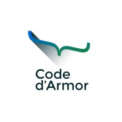
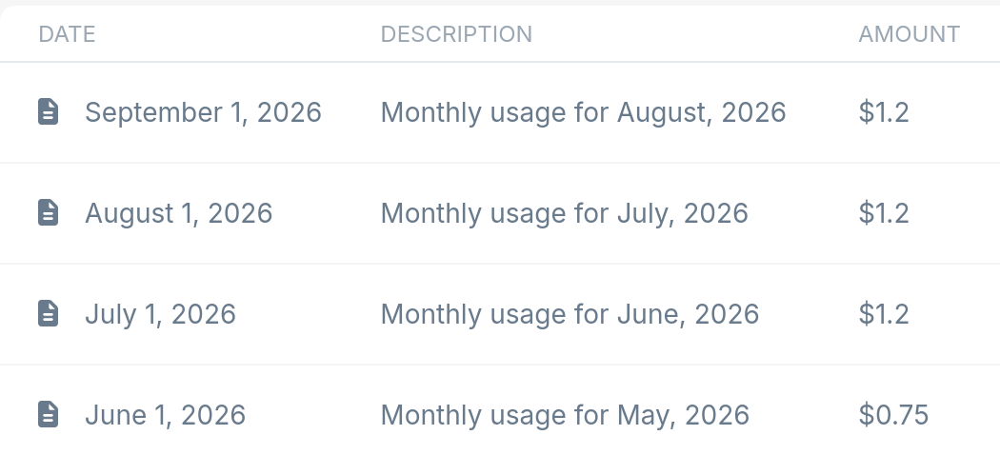

<!-- _class: lead -->

<div class="logo-top-right">



</div>

<div class="logo-bottom-right">


</div>

# Goodbye GitHub
## Un site statique avec Codeberg et Bunny


<br>

## **30 minutes · retour d'expérience**

---

## 👋 Qui suis-je ?

- Consultant et formateur indépendant
- Développeur depuis 15 ans
- Expert automatisation et DevOps
- Fan des outils libres
- Curieux des sujets de souveraineté


### [linkedin.com/in/mathieulaude](https://www.linkedin.com/in/mathieulaude/)

---

# Une question simple

<br>

<div class="quote">
  Pour publier un site statique,<br>
  <strong>qui parmi vous utilise GitHub Pages ?</strong>
</div>

---

# Une question simple

<br>

<div class="quote">
  Pour publier un site statique,<br>
  <strong>qui parmi vous utilise GitHub Pages ?</strong>
</div>

<br>

<div class="big">GitHub Pages est pratique.</div>
<div class="muted">Mais ce n'est pas la seule façon de faire.</div>

---

# Le résultat attendu

<div class="chain">
  <div class="step small">🧑‍💻<br>Dévelop-<br>pement</div>
  <div class="arrow">→</div>
  <div class="step small">📦<br>Stockage</div>
  <div class="arrow">→</div>
  <div class="step small">⚙️<br>Constru-<br>ction</div>
  <div class="arrow">→</div>
  <div class="step small">🏠<br>Héberge-<br>ment</div>
  <div class="arrow">→</div>
  <div class="step small">🌍<br>Visiteur</div>
</div>

<br>

<center><strong>Un push, un build, un site en ligne.</strong></center>

---

# Pourquoi regarder ailleurs ?

<div class="container">
<div class="col red">

### Vendor lock-in

Un acteur unique pour :

- le code
- la collaboration
- la CI
- l'hébergement

</div>
<div class="col green">

### Nouveaux critères

Souveraineté, vie privée,
modèle économique, résilience.

<br>

<strong>Bonus : un retour à la simplicité</strong>

</div>
</div>

<br>

<center class="muted">Pas anti-GitHub : pro-choix.</center>

---

# Deux briques

<div class="container">
<div class="col green">

## Codeberg

Forge Git européenne

**Le dépôt et la collaboration**

</div>
<div class="col orange">

## Bunny

Storage + CDN

**La diffusion du site**

</div>
</div>

<br>

<center>Entre les deux : <strong>Forgejo Actions</strong></center>

---

# Codeberg

<div class="big">Une forge Git, portée par une association.</div>

<br>

<div class="container">
<div class="col">

🇪🇺 Hébergée en Europe

</div>
<div class="col">

🤝 Codeberg e.V.

</div>
<div class="col">

💚 Logiciel libre

</div>
</div>

<br>

<center class="muted">Pas une copie de GitHub : un autre modèle.</center>

---

# Forgejo : le moteur

<div class="container">
<div class="col green">

### Libre

Le code peut être étudié,
modifié et auto-hébergé.

</div>
<div class="col green">

### Compatible

Une syntaxe proche des
workflows GitHub Actions.

</div>
<div class="col green">

### Hébergeable ailleurs

Forgejo peut être installé par différentes organisations.

</div>
</div>

---

# Un choix, donc des compromis

<div class="container">
<div class="col green">

### On gagne

- indépendance
- transparence
- simplicité
- contrôle

</div>
<div class="col orange">

### On accepte

- un écosystème plus petit
- moins d'intégrations
- des runners limités
- moins de tout-en-un

</div>
</div>

<br>

<center><strong>Le bon outil pour le bon usage</strong></center>

---

# Automatiser le build

<div class="chain">
  <div class="step">Push</div>
  <div class="arrow">→</div>
  <div class="step">Forgejo<br>Actions</div>
  <div class="arrow">→</div>
  <div class="step">Générateur<br>statique</div>
  <div class="arrow">→</div>
  <div class="step">Artefacts</div>
</div>

<br>

<center class="muted">Logique d'une CI classique, générateur en option (peut être local)</center>

---

# Un workflow minimal

```yaml
name: build

on:
  push:
    branches: [main]

jobs:
  build:
    runs-on: docker
    steps:
      - uses: actions/checkout@v4
      - run: hugo
      - run: upload public/ to Bunny Storage
```

<center><strong>Le dépôt héberge le code, le workflow décrit la livraison.</strong></center>

---

# Bunny.net : la vitesse comme promesse

<div class="container">
<div class="col orange">


### 🐇 Bunny

Rendre Internet plus rapide,
tel un lièvre.

<br>

Né en Suède en 2015.

<br>

**Pricing à la bande passante**

</div>

<div class="col orange">

<center class="muted">Pour 4 sites à faible trafic </center>

<br>



</div>
</div>

<center class="muted">Une brique européenne pour servir notre site statique.</center>

---

# Publier sans serveur

<div class="container">
<div class="col orange">

## Bunny Storage

Le stockage des fichiers
HTML, CSS, JS, images.

</div>
<div class="col orange">

## Bunny CDN

Cache, HTTPS et diffusion
proche des visiteurs.

</div>
</div>

<br>

<center class="muted">Pas de serveur, pas de maintenance<br>
Pas de maintenance, pas de CVE<br>
Pas de CVE, ... pas de CVE</center>

---

<!-- _class: terraform -->

# Un module Terraform pour tout créer

<div class="container">
<div class="col red">

### Un seul appel crée :

- Le dépôt Forgejo
- Le stockage Bunny
- Le CDN Bunny
- Les secrets
- Le workflow CI

</div>
<div class="col green">

<div>

<br><br>
```hcl
module "my_site" {
  source = "git::https://codeberg.org/
    mathieulaude/static-site-module.git"
  name   = "my-site"
}
```

</div>

</div>
</div>

<center><strong>Objectif : décrire la chaîne complète en Terraform</strong>

<br>

[codeberg.org/mathieulaude/static-site-module](https://codeberg.org/mathieulaude/static-site-module)

</center>

---

# GitHub Pages vs Codeberg + Bunny

| | GitHub Pages | Codeberg + Bunny |
|---|---|---|
| Dépôt | GitHub | Codeberg |
| Build | GitHub Actions | Forgejo Actions |
| Publication | Pages | Storage + CDN |
| Modèle | Plateforme commerciale 🇺🇸 | Association non lucrative 🇪🇺 |

---

# Ce qu'il faut retenir

<div class="big">Sortir de GitHub (Pages) est possible.</div>

<br>

1. Un dépôt Git n'est pas lié à une seule forge.
2. Un site statique est simple à héberger.
3. La simplicité vient du choix des outils, pas d'une intégration forte.

<br>

<center><strong>Codeberg → Forgejo → Bunny</strong></center>

---

# Merci

## Des questions ?

<div class="logo-top-right">


</div>

<br>

<center class="muted">Le support et le projet exemple seront disponibles dans le dépôt.</center>

---

# Merci

<div class="logo-top-right">


</div>

<br>

<center class="muted">Le support et le projet exemple seront disponibles dans le dépôt.</center>

---

# Sources

- https://david.drugeon-hamon.bzh/blog/2026/04/migration-github-codeberg/
- [Codeberg Community Documentation](https://docs.codeberg.org/)
- [Forgejo Actions](https://forgejo.org/docs/latest/user/actions/)
- [Bunny.net Documentation](https://docs.bunny.net/)
- [Bunny.net Pricing](https://bunny.net/pricing/)
